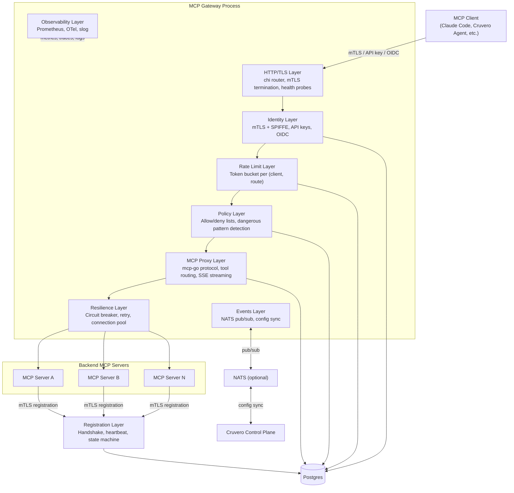
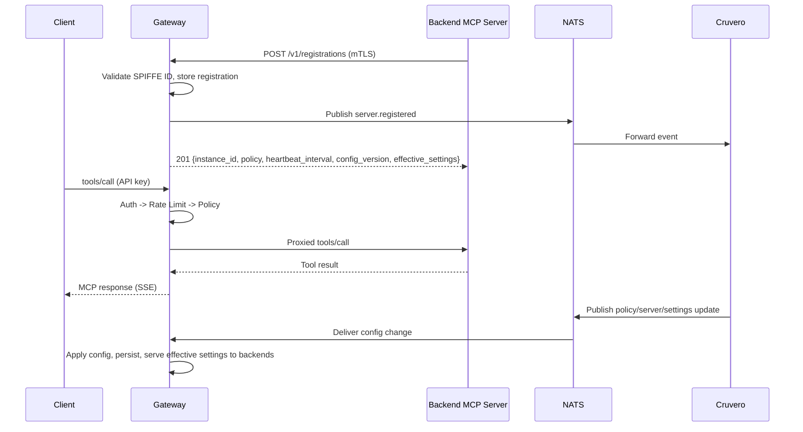
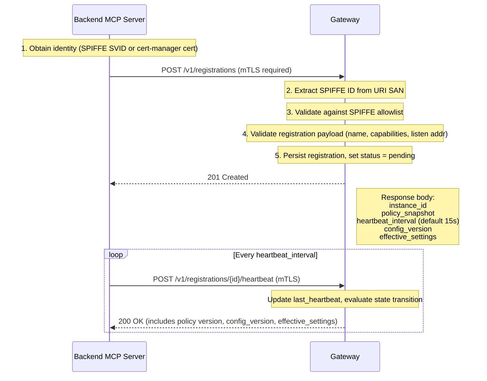
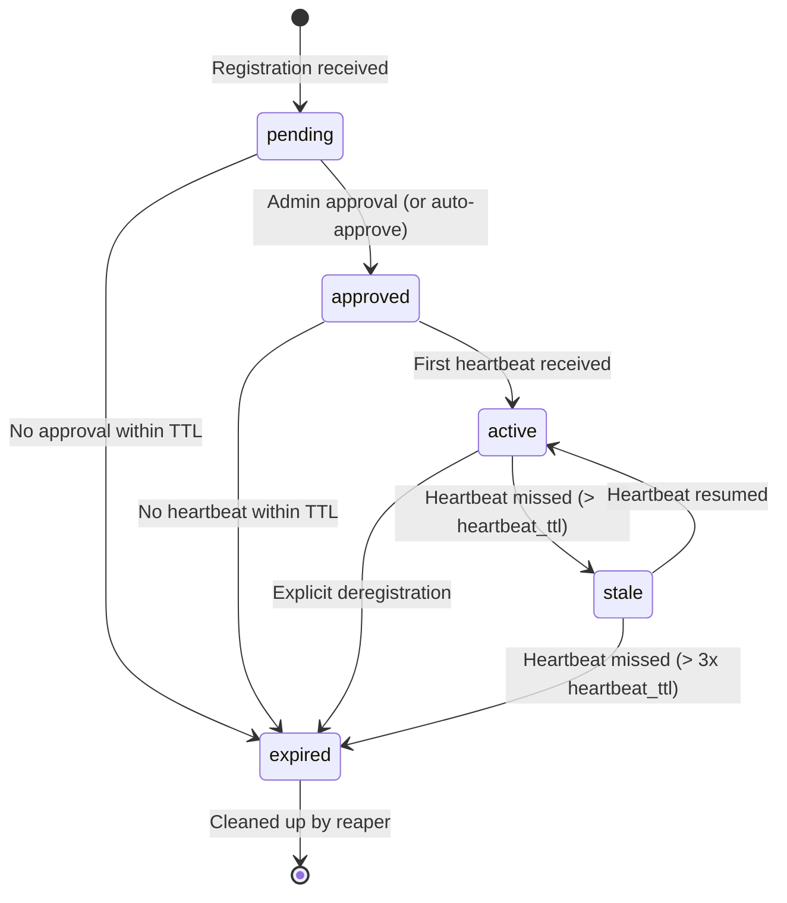
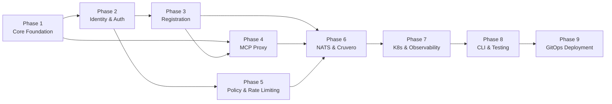

# MCP K8s Gateway -- Architecture Reference

## 1. Introduction

The MCP Gateway (`cruvero-mcp-gateway`) is a pure-Go mTLS reverse proxy that sits in front of one or more MCP (Model Context Protocol) server deployments. It auto-discovers and registers backend MCP servers via a handshake protocol, aggregates their tool and resource catalogs into a single endpoint, and proxies client requests to the correct backend. The gateway enforces per-client rate limits, tool-level safety policies, and circuit breakers on unhealthy backends.

The gateway **is itself an MCP server**. Clients connect to it using the standard MCP protocol (Streamable HTTP / SSE transport). From the client's perspective, there is one MCP server exposing the union of all registered backends' capabilities.

It operates in two modes:

- **Standalone mode** -- authentication via API keys or OIDC tokens. The gateway maintains its own Postgres database and requires no external control plane. CLI tools such as Claude Code connect directly.
- **Cruvero-integrated mode** -- the gateway joins a NATS event bus to synchronize state with Cruvero's control plane. Cruvero becomes the source of truth for policy configuration and server metadata. The Cruvero UI surfaces server health, connection status, and policy management. The gateway continues to function if NATS becomes unavailable, falling back to its last-known configuration.

In both modes, the gateway owns its Postgres database for persistence. When integrated with Cruvero, lifecycle events are published over NATS and Cruvero's registry receives replicated state.

---

## 2. Architecture Overview

The gateway is structured as a layered system. Each layer has a single responsibility and communicates with adjacent layers through well-defined Go interfaces.



### Layer Descriptions

**HTTP/TLS Layer** -- chi router handles request routing, TLS termination (TLS 1.3 minimum), and exposes `/healthz` (liveness) and `/readyz` (readiness) probes. All non-probe endpoints require authentication.

**Identity Layer** -- determines caller identity. For backend MCP servers connecting to register or heartbeat, identity is extracted from the mTLS client certificate (SPIFFE URI SAN). For end-user clients, identity comes from a hashed API key or a validated OIDC token. A unified middleware selects the correct authentication method based on request characteristics.

**Registration Layer** -- manages the lifecycle of backend MCP servers. Implements the registration handshake, periodic heartbeat processing, and a state machine that transitions servers through `pending`, `approved`, `active`, `stale`, and `expired` states.

**MCP Proxy Layer** -- implements the MCP server protocol using `mcp-go`. Aggregates `tools/list` responses from all active backends into a unified catalog. Routes `tools/call` to the correct backend by tool name via an internal capability index. Handles `resources/list` and `resources/read` by URI prefix routing. Uses Streamable HTTP (SSE) transport.

**Policy Layer** -- evaluates every tool invocation against configurable rules. Supports per-policy-profile allow/deny lists, dangerous command pattern detection (shell injection, `rm -rf`, `sudo`, network exfiltration), and argument validation against tool input schemas. Operates in `enforce` (block) or `audit` (log-only) mode. All decisions are recorded in the audit log.

**Rate Limit Layer** -- token bucket rate limiter keyed by `(client_identity, route)`. Configurable per policy profile (default, premium, admin). Injects standard rate limit headers into responses. A background goroutine cleans up expired limiters.

**Resilience Layer** -- wraps upstream connections with circuit breakers (configurable failure threshold and recovery timeout), retry with exponential backoff, and a connection pool for backend MCP servers.

**Events Layer** -- NATS pub/sub client for Cruvero integration. Publishes lifecycle events (registration, deregistration, health changes, policy violations). Subscribes to configuration updates from Cruvero. Degrades gracefully: if NATS is unavailable, the gateway continues with its last-known configuration.

**Observability Layer** -- Prometheus metrics exposed on a dedicated port, OpenTelemetry tracing with spans across the full request pipeline, and `slog` structured logging with JSON output.

---

## 3. Data Flow

### Standalone Mode

```
Client
  |
  |-- mTLS handshake / API key header / OIDC bearer token
  v
HTTP/TLS Layer (chi router)
  |
  |-- extract identity
  v
Identity Layer
  |
  |-- check token bucket
  v
Rate Limit Layer
  |
  |-- evaluate allow/deny + pattern checks
  v
Policy Layer
  |
  |-- route tools/call by tool name, resources/read by URI prefix
  v
MCP Proxy Layer (mcp-go)
  |
  |-- circuit breaker check, retry on transient failure
  v
Resilience Layer
  |
  v
Backend MCP Server
```

Every step produces structured log entries and OTel trace spans. Rate limit and policy decisions emit Prometheus counter increments.

### Cruvero-Integrated Mode

The request path is identical to standalone mode. The following additions apply:

1. **Outbound events** -- on registration, deregistration, health state changes, and policy violations, the Events Layer publishes a structured event to NATS on `mcpgw.{gateway_id}.events.{type}`.
2. **Inbound config** -- the Events Layer subscribes to `mcpgw.{gateway_id}.config.>` subjects. When Cruvero publishes policy, server, auth, or non-secret server-settings updates, the gateway applies them to its in-memory state and persists to Postgres.
3. **Cruvero as source of truth** -- when integrated, Cruvero owns the canonical policy configuration. The gateway's local Postgres stores a replica for resilience.



---

## 4. Package Map

All packages live under `internal/`. There is one public command entry point at `cmd/mcpgw`.

| Package | Description |
|---------|-------------|
| `auth` | API key validation (deterministic lookup hash + bcrypt verification), OIDC token verification (go-oidc), middleware that selects auth method per request |
| `config` | Environment-based configuration loader; all `MCPGW_*` variables parsed into a typed `Config` struct with validation |
| `events` | NATS client wrapper, event type definitions, publish/subscribe helpers (including server-settings sync), graceful degradation on disconnect |
| `identity` | mTLS certificate inspection, SPIFFE ID extraction from URI SANs, trust bundle management, allowlist enforcement |
| `policy` | Tool allow/deny list evaluation, dangerous command pattern matching, argument schema validation, enforcement mode toggle |
| `proxy` | MCP protocol handler via mcp-go; tool catalog aggregation, tool-call routing by name, resource routing by URI prefix, SSE transport |
| `ratelimit` | Token bucket implementation using `golang.org/x/time/rate`, keyed by (client, route), per-profile configuration, background cleanup |
| `registration` | Server registration handshake handler, heartbeat processor, state machine (pending/approved/active/stale/expired), capability indexing, and effective-settings response shaping |
| `resilience` | Circuit breaker (failure threshold + recovery timeout), retry with exponential backoff, HTTP connection pool for backends |
| `server` | HTTP server bootstrap, chi router setup, middleware chain assembly, TLS configuration, health probe handlers |
| `store` | Postgres store interfaces and implementations for servers, API keys, audit log, and configuration; migration runner |
| `testutil` | Test helpers: in-memory stores, fake NATS, certificate generators, HTTP test server builders |
| `types` | Shared types used across packages: `ServerRecord`, `Capability`, `PolicyProfile`, `AuditEntry`, `RegistrationRequest/Response` |

---

## 5. Database Schema

The gateway uses Postgres for persistence. Migrations are sequential files in `migrations/` following the pattern `NNNN_description.up.sql` / `.down.sql`.

### mcp_servers

Tracks registered backend MCP servers and their lifecycle state.

```sql
CREATE TABLE mcp_servers (
    id              UUID PRIMARY KEY DEFAULT gen_random_uuid(),
    name            TEXT NOT NULL,
    spiffe_id       TEXT NOT NULL UNIQUE,
    version         TEXT NOT NULL DEFAULT '',
    host            TEXT NOT NULL,
    port            INTEGER NOT NULL,
    capabilities    JSONB NOT NULL DEFAULT '{}',
    status          TEXT NOT NULL DEFAULT 'pending',
    policy_profile  TEXT NOT NULL DEFAULT 'default',
    rate_limit      INT,
    rate_burst      INT,
    last_heartbeat  TIMESTAMPTZ,
    created_at      TIMESTAMPTZ NOT NULL DEFAULT now(),
    updated_at      TIMESTAMPTZ NOT NULL DEFAULT now(),

    CONSTRAINT chk_mcp_servers_rate_limit_nonnegative
        CHECK (rate_limit IS NULL OR rate_limit >= 0),
    CONSTRAINT chk_mcp_servers_rate_burst_nonnegative
        CHECK (rate_burst IS NULL OR rate_burst >= 0),
    CONSTRAINT chk_mcp_servers_rate_burst_requires_limit
        CHECK (rate_burst IS NULL OR rate_limit IS NOT NULL)
);

CREATE INDEX idx_mcp_servers_status ON mcp_servers (status);
CREATE INDEX idx_mcp_servers_spiffe_id ON mcp_servers (spiffe_id);
```

The `status` column holds one of: `pending`, `approved`, `active`, `stale`, `expired`. The `capabilities` JSONB stores the server's declared tools, resources, and prompts. The `rate_limit` and `rate_burst` columns allow per-server rate limit overrides: `NULL` uses global defaults, `0` blocks all requests, and positive values set a custom token-bucket rate.

### api_keys

Stores hashed API keys for CLI user authentication.

```sql
CREATE TABLE api_keys (
    id               UUID PRIMARY KEY DEFAULT gen_random_uuid(),
    key_lookup_hash  TEXT NOT NULL UNIQUE,
    key_bcrypt_hash  TEXT NOT NULL,
    name             TEXT NOT NULL,
    client_id        TEXT NOT NULL,
    scopes           TEXT[] NOT NULL DEFAULT '{}',
    expires_at       TIMESTAMPTZ,
    created_at       TIMESTAMPTZ NOT NULL DEFAULT now()
);

CREATE INDEX idx_api_keys_lookup_hash ON api_keys (key_lookup_hash);
CREATE INDEX idx_api_keys_client_id ON api_keys (client_id);
```

The gateway stores both a deterministic lookup hash (`key_lookup_hash`, SHA-256 of plaintext key) and a bcrypt hash (`key_bcrypt_hash`) for verification. The `scopes` array contains permission strings: `read`, `write`, `admin`; scope value validation is enforced in the application layer.

### policy_profiles

`PolicyProfile` values are configuration-driven in the baseline roadmap (environment defaults plus Cruvero sync) and are not persisted in a dedicated `policy_profiles` table in the current phases.

### audit_log

Append-only log of all policy decisions, authentication events, and lifecycle changes.

```sql
CREATE TABLE audit_log (
    id          UUID PRIMARY KEY DEFAULT gen_random_uuid(),
    event_type  TEXT NOT NULL,
    client_id   TEXT NOT NULL DEFAULT '',
    server_name TEXT NOT NULL DEFAULT '',
    details     JSONB NOT NULL DEFAULT '{}',
    created_at  TIMESTAMPTZ NOT NULL DEFAULT now()
);

CREATE INDEX idx_audit_log_event_type ON audit_log (event_type);
CREATE INDEX idx_audit_log_created_at ON audit_log (created_at);
```

Event types include: `auth.success`, `auth.failure`, `policy.allow`, `policy.deny`, `ratelimit.exceeded`, `server.registered`, `server.deregistered`, `server.stale`, `server.expired`.

Retention for `audit_log` is operationally required in production. Use partitioning or scheduled archival/deletion to prevent unbounded growth.

---

## 6. Registration Protocol

Backend MCP servers register with the gateway through a multi-step handshake protocol. The gateway treats all registration payloads as untrusted input.

### Handshake Flow



### Steps in Detail

1. **Identity acquisition** -- the backend MCP server obtains an X.509 identity. With SPIFFE/SPIRE, this is an SVID delivered via the Workload API socket (mounted via CSI driver). With cert-manager, a `Certificate` resource provisions the cert into a Secret.

2. **Registration request** -- the server sends `POST /v1/registrations` over mTLS. The request body contains the server's logical name, version, listen address, and declared capabilities (tools, resources, prompts). Labels (environment, team, risk tier) are optional metadata.

3. **Identity validation** -- the gateway extracts the SPIFFE ID from the client certificate's URI SAN. It checks the ID against a configurable allowlist of prefixes (`MCPGW_SPIFFE_ALLOW_PREFIX`). If the ID does not match any allowed prefix, the request is rejected with 403.

4. **Payload validation** -- the gateway validates all fields in the registration payload: name format, port range, capability structure. Capabilities are treated as descriptive hints for routing and catalog aggregation, never as authorization grants.

5. **Persistence and response** -- the gateway stores the registration in Postgres with status `pending` (or `approved` if auto-approval is enabled). It returns the assigned instance ID, the effective policy snapshot for the server's profile, the heartbeat interval, and the current effective non-secret settings with a config version.

6. **Heartbeat** -- the server sends periodic heartbeats to `POST /v1/registrations/{id}/heartbeat`. Each heartbeat updates `last_heartbeat`, may trigger state transitions (e.g., `pending` to `active` after admin approval, or `stale` back to `active`), and returns the latest effective non-secret settings and config version for server-side apply.

### State Machine



- **pending** -- registration received, awaiting admin approval or auto-approval policy.
- **approved** -- approved but no heartbeat yet; the server has not confirmed it is ready.
- **active** -- healthy and receiving traffic. The gateway routes requests to this backend.
- **stale** -- heartbeat missed. The gateway stops routing new requests but keeps the registration. If the server resumes heartbeating, it transitions back to active.
- **expired** -- permanently removed from routing. A background reaper goroutine periodically deletes expired records.

---

## 7. MCP Proxy Protocol

The gateway implements the MCP server protocol using `mcp-go` (`github.com/mark3labs/mcp-go`). From the perspective of an MCP client, the gateway is a single MCP server.

### Tool Catalog Aggregation

When a client sends `tools/list`, the gateway iterates over all `active` backend servers, merges their tool declarations into a single list, and returns it. Tool names must be globally unique across backends; if a conflict is detected at registration time, the gateway rejects the conflicting registration or namespaces the tool (configurable).

### Tool Call Routing

When a client sends `tools/call` with a specific tool name, the gateway looks up the tool in its internal capability index (an in-memory map of tool name to backend server ID). It forwards the call to the owning backend via the resilience layer and streams the response back to the client.

### Resource Routing

`resources/list` aggregates resource declarations from all active backends. `resources/read` routes to the correct backend based on URI prefix matching. Each backend registers the URI prefixes it serves during the registration handshake.

### Transport

The gateway uses Streamable HTTP (SSE) transport for client-facing connections. Backend connections use HTTP with SSE where the backend supports it, falling back to standard HTTP request/response.

---

## 8. Authentication Modes

The gateway supports three authentication methods. A unified middleware selects the method based on request characteristics.

### mTLS with SPIFFE IDs

Used by backend MCP server pods for registration and heartbeat endpoints.

- Client presents an X.509 certificate during TLS handshake.
- Gateway validates the certificate chain against the configured CA bundle (`MCPGW_TLS_CA`).
- Identity is extracted from the first SPIFFE URI SAN (`spiffe://trust-domain/workload-path`).
- Authorization is checked against the SPIFFE ID allowlist (`MCPGW_SPIFFE_ALLOW_PREFIX`).

### API Keys

Used by CLI users (Claude Code, other MCP clients) for tool invocations.

- Client sends `Authorization: Bearer <key>` header.
- Gateway computes a deterministic lookup hash (SHA-256) and queries `api_keys.key_lookup_hash`.
- Gateway verifies the plaintext key against `api_keys.key_bcrypt_hash` with bcrypt.
- The associated `client_id` and `scopes` determine identity and permissions.
- Expired keys are rejected.

### OIDC

Used by enterprise CLI users or service-to-service flows.

- Client sends `Authorization: Bearer <jwt>` header.
- Gateway validates the JWT against the configured OIDC issuer (`MCPGW_OIDC_ISSUER`) using `go-oidc`.
- The `sub` claim becomes the client identity; `scope` or custom claims determine permissions.
- The `aud` claim must match `MCPGW_OIDC_AUDIENCE`.

### Method Selection

The middleware inspects each request in order:

1. If the request has a verified mTLS client certificate with a SPIFFE URI SAN, use mTLS identity.
2. If the `Authorization` header contains a JWT (detected by structure), validate via OIDC.
3. If the `Authorization` header contains a non-JWT bearer token, validate as API key.
4. Otherwise, reject with 401.

---

## 9. Rate Limiting

Rate limiting uses a token bucket algorithm (`golang.org/x/time/rate`) keyed by `(client_identity, route)`.

### Configuration

Each policy profile defines rate parameters:

| Profile | Requests/sec | Burst |
|---------|-------------|-------|
| `default` | 10 | 20 |
| `premium` | 50 | 100 |
| `admin` | 100 | 200 |

These defaults are overridden by `MCPGW_RATE_DEFAULT` and `MCPGW_RATE_BURST` for the default profile, and by Cruvero-delivered configuration for named profiles.

### Behavior

- On each request, the middleware resolves the client's policy profile and looks up (or creates) a limiter for the `(client_id, route)` tuple.
- If the limiter rejects the request, the gateway returns HTTP 429 with headers:
  - `X-RateLimit-Limit` -- the rate limit ceiling.
  - `X-RateLimit-Remaining` -- tokens remaining.
  - `Retry-After` -- seconds until the next token is available.
- A background goroutine runs periodically to remove limiters that have been idle beyond a configurable TTL, preventing unbounded memory growth.

### Multi-Replica Rate Limiting

The baseline roadmap is local-only token buckets. Global multi-replica rate limiting is intentionally out of scope until a dedicated design and migration plan is added.

---

## 10. Policy Engine

The policy engine evaluates every `tools/call` request against a set of configurable rules. Policies are organized into profiles; each registered backend and each API key is assigned a profile.

### Rule Types

**Tool allowlist** -- only tools explicitly listed may be invoked. If the allowlist is empty, all tools are permitted (subject to denylist).

**Tool denylist** -- tools on this list are always blocked, regardless of the allowlist.

**Dangerous command pattern detection** -- the engine scans tool arguments for patterns that indicate risky operations:

| Pattern Category | Examples |
|-----------------|----------|
| Destructive filesystem | `rm -rf`, `rmdir`, `mkfs`, `dd if=` |
| Privilege escalation | `sudo`, `su -`, `chmod 777`, `chown root` |
| Shell injection | `; command`, `$()`, backtick substitution, pipe to shell |
| Network exfiltration | `curl`, `wget`, `nc`, `scp` to external hosts |
| Credential access | `/etc/shadow`, `~/.ssh`, `AWS_SECRET`, `PRIVATE_KEY` |

**Argument schema validation** -- if a tool declares an input schema (JSON Schema), the engine validates the provided arguments against it before forwarding the call.

### Enforcement Modes

- **enforce** -- violating requests are blocked with HTTP 403. The denial is logged to `audit_log`.
- **audit** -- violating requests are allowed through but logged to `audit_log` with `event_type = policy.audit`. This mode is used during rollout to observe policy behavior before enforcing.

### Audit Trail

Every policy decision (allow or deny) is recorded in the `audit_log` table with:
- The tool name and arguments (redacted if sensitive).
- The matched rule (allowlist, denylist, pattern, schema).
- The client identity and backend server.
- The enforcement mode and final decision.

---

## 11. NATS Integration

When `MCPGW_CRUVERO_ENABLED=true` and `MCPGW_NATS_URL` is set, the gateway connects to a NATS server for bidirectional communication with Cruvero.

### Published Events

The gateway publishes events when backend server lifecycle or policy state changes.

| Subject | Payload | Trigger |
|---------|---------|---------|
| `mcpgw.{gateway_id}.events.server.registered` | ServerRecord | New registration accepted |
| `mcpgw.{gateway_id}.events.server.deregistered` | ServerRecord | Server expired or explicitly removed |
| `mcpgw.{gateway_id}.events.server.health_changed` | ServerRecord + old/new status | State machine transition |
| `mcpgw.{gateway_id}.events.policy.violated` | AuditEntry | Policy deny in enforce mode |

All payloads are JSON-encoded. The `MCPGW_GATEWAY_ID` is included in every event for multi-gateway deployments.

### Subscribed Subjects

The gateway subscribes to configuration updates from Cruvero.

| Subject Pattern | Payload | Effect |
|----------------|---------|--------|
| `mcpgw.{gateway_id}.config.policy` | PolicyProfile[] | Replace policy profiles |
| `mcpgw.{gateway_id}.config.servers` | ServerRecord[] | Sync server metadata (approval status, profile assignment) |
| `mcpgw.{gateway_id}.config.server_settings` | ServerSettingsConfig[] | Sync effective non-secret runtime settings (versioned) for backend MCP servers |
| `mcpgw.{gateway_id}.config.auth` | AuthConfig | Update API key and OIDC settings |

### Backend Server Settings Control

For backend MCP servers connected in gateway mode:

- Cruvero-provided non-secret settings are authoritative over server env defaults.
- The gateway computes effective settings per server and attaches them to registration and heartbeat responses with a `config_version`.
- Backend servers apply only hot-reload-safe keys at runtime.
- If a backend rejects an invalid settings update, it keeps last-known-good settings and reports rejection status in heartbeat metadata.

### Subject Naming Convention

```
mcpgw.{gateway_id}.events.{event_type}     -- gateway publishes
mcpgw.{gateway_id}.config.{config_scope}   -- gateway subscribes (Cruvero publishes)
```

### Graceful Degradation

If the NATS connection drops:
- Event publishing is silently dropped (fire-and-forget with a bounded outbox).
- Configuration subscriptions resume on reconnect; Cruvero re-sends current state on reconnect handshake.
- The gateway continues operating with its last-known configuration persisted in Postgres, including last-known-good server settings.
- NATS connection status is exposed via the `/readyz` probe and a Prometheus gauge.

---

## 12. Observability

### Prometheus Metrics

Exposed on `MCPGW_METRICS_ADDR` (default `:9090`) via `promhttp.Handler()`.

| Metric | Type | Labels | Description |
|--------|------|--------|-------------|
| `mcpgw_http_requests_total` | Counter | `method`, `path`, `status_code` | Total HTTP requests |
| `mcpgw_http_request_duration_seconds` | Histogram | `method`, `path` | Request latency distribution |
| `mcpgw_rate_limited_total` | Counter | `route`, `client_id` | Requests rejected by rate limiter |
| `mcpgw_policy_denied_total` | Counter | `reason`, `tool` | Requests blocked by policy engine |
| `mcpgw_active_registrations` | Gauge | `status` | Current backend server count by status |
| `mcpgw_upstream_errors_total` | Counter | `backend`, `error_type` | Errors from backend MCP servers |
| `mcpgw_circuit_breaker_state` | Gauge | `backend`, `state` | Circuit breaker state by backend/state pair (1=open for that state label, 0 otherwise) |
| `mcpgw_nats_connected` | Gauge | -- | NATS connection status (0 or 1) |
| `mcpgw_server_settings_applied_total` | Counter | `server_name` | Count of successful non-secret settings applies by backend server |
| `mcpgw_server_settings_rejected_total` | Counter | `server_name`, `reason` | Count of rejected non-secret settings updates |
| `mcpgw_server_settings_version` | Gauge | `server_name` | Last config version served to each backend server |

### OpenTelemetry Tracing

The gateway instruments the full request pipeline with OTel spans:

```
[gateway.request]
  |-- [auth.validate]
  |-- [ratelimit.check]
  |-- [policy.evaluate]
  |-- [proxy.route]
       |-- [resilience.upstream_call]
            |-- [backend.{server_name}.{tool_name}]
```

Traces are exported via OTLP (gRPC or HTTP) to a configured collector endpoint.

### Structured Logging

All log output uses `slog` with JSON format (configurable to `text` for development). Every log entry includes:

- `request_id` -- unique per request, propagated to backends.
- `client_id` -- resolved identity of the caller.
- `server_name` -- backend server name (when applicable).
- `duration_ms` -- request duration.
- `level` -- configurable via `MCPGW_LOG_LEVEL`.

---

## 13. Kubernetes Deployment

### Local Devcontainer Baseline

Before cluster deployment work, use a repository `.devcontainer` so testing and packaging run in a reproducible local environment. The devcontainer must include Go, Helm, `kubectl`, and Argo CD CLI tooling. All deployment changes should be validated locally in-container before GitOps sync.

### Container Image

The gateway ships as a single static binary in a distroless image:

```dockerfile
FROM gcr.io/distroless/static-debian12:nonroot
COPY mcpgw /mcpgw
USER nonroot:nonroot
ENTRYPOINT ["/mcpgw"]
```

Build flags: `CGO_ENABLED=0 GOOS=linux GOARCH=amd64`, `-trimpath`, `-ldflags="-s -w"`.

### Helm Chart

The Helm chart is located at `charts/mcpgateway/`. It includes:

- Deployment with configurable replicas, resource requests/limits, and security context.
- Service (ClusterIP) exposing the gateway port.
- HPA (`autoscaling/v2`) with CPU-based scaling and stabilization window.
- PodDisruptionBudget.
- ConfigMap for non-secret environment variables.
- Vault operator templates (`VaultAuth` / `VaultStaticSecret`) and runtime `existingSecret` references for sensitive values.
- cert-manager `Certificate` resources for gateway TLS and client CA.
- NetworkPolicy (default deny + explicit allow rules).
- ServiceMonitor for Prometheus Operator.
- Optional NATS subchart dependency.

### GitOps Deployment with Argo CD ApplicationSet

Deployment is managed through Argo CD manifests in `deploy/argocd/`, following the same pattern used in the parent platform:

- `project.yaml` defines source repositories, allowed destinations, and sync windows.
- `applicationset.yaml` defines environment-specific releases via list generator entries (`env`, `namespace`, `valuesFile`, `targetRevision`, `autoSync`, `prune`, `selfHeal`).
- Helm sources use `values.yaml` + environment overlay files (for example `values-dev.yaml`).
- Dev environment enables automated sync first; staging/prod stay gated until explicitly enabled.

### GitHub Actions and Secret Conventions

Any GitHub Actions workflow in this repository must follow these standards:

- Use `ubuntu-latest` for `runs-on`.
- Harbor image operations must use org secrets:
  - `HARBOR_URL`
  - `HARBOR_TOKEN`
- Sonar workflows must use org secrets:
  - `SONAR_HOST_URL`
  - `SONAR_TOKEN`
- Sonar workflows must use repo secret:
  - `SONAR_PROJECT_KEY`

### Secret Management (Vault Operator)

Application runtime secrets are sourced by Vault operator resources, not committed plaintext Kubernetes Secret manifests:

- `VaultAuth` identifies Kubernetes auth configuration for the namespace.
- `VaultStaticSecret` syncs KV values into a destination secret consumed by deployments.
- Chart values use secret references (`existingSecret`) rather than inline credentials.

### Security Context

All pods run with the Kubernetes "restricted" security posture:

```yaml
securityContext:
  runAsNonRoot: true
  runAsUser: 65532
  runAsGroup: 65532
  allowPrivilegeEscalation: false
  readOnlyRootFilesystem: true
  capabilities:
    drop: ["ALL"]
  seccompProfile:
    type: RuntimeDefault
```

### Network Policy

Default deny for both ingress and egress, with explicit rules:

- **Ingress**: allow traffic to gateway port from configured namespaces/pods.
- **Egress**: allow traffic to Postgres, NATS (if enabled), backend MCP server pods, and DNS.

### Autoscaling

HPA configuration:

```yaml
minReplicas: 2
maxReplicas: 10
behavior:
  scaleDown:
    stabilizationWindowSeconds: 300
    policies:
    - type: Percent
      value: 20
      periodSeconds: 60
metrics:
- type: Resource
  resource:
    name: cpu
    target:
      type: Utilization
      averageUtilization: 70
```

PDB ensures at least one replica is always available during voluntary disruptions.

---

## 14. Environment Variables

All configuration is via environment variables with the `MCPGW_` prefix. No configuration files.

| Variable | Default | Description |
|----------|---------|-------------|
| `MCPGW_LISTEN_ADDR` | `:8443` | Server listen address |
| `MCPGW_TLS_CERT` | -- | Path to server TLS certificate |
| `MCPGW_TLS_KEY` | -- | Path to server TLS private key |
| `MCPGW_TLS_CA` | -- | Path to client CA bundle for mTLS |
| `MCPGW_DB_URL` | -- | Postgres connection string |
| `MCPGW_NATS_URL` | -- | NATS server URL (empty disables NATS) |
| `MCPGW_OIDC_ISSUER` | -- | OIDC issuer URL (empty disables OIDC) |
| `MCPGW_OIDC_AUDIENCE` | -- | Expected OIDC audience claim |
| `MCPGW_HEARTBEAT_TTL` | `30s` | Duration before a server is marked stale |
| `MCPGW_RATE_DEFAULT` | `10` | Default token bucket rate (requests/sec) |
| `MCPGW_RATE_BURST` | `20` | Default token bucket burst size |
| `MCPGW_CIRCUIT_THRESHOLD` | `5` | Consecutive failures to open circuit |
| `MCPGW_CIRCUIT_TIMEOUT` | `30s` | Duration before half-open retry |
| `MCPGW_RETRY_MAX` | `3` | Maximum retry attempts for upstream calls |
| `MCPGW_SPIFFE_ALLOW_PREFIX` | -- | Comma-separated allowed SPIFFE ID prefixes |
| `MCPGW_LOG_FORMAT` | `json` | Log output format (`json` or `text`) |
| `MCPGW_LOG_LEVEL` | `info` | Minimum log level (`debug`, `info`, `warn`, `error`) |
| `MCPGW_METRICS_ADDR` | `:9090` | Prometheus metrics listen address |
| `MCPGW_CRUVERO_ENABLED` | `false` | Enable Cruvero integration via NATS |
| `MCPGW_GATEWAY_ID` | `auto` | Gateway instance ID (included in NATS events) |
| `MCPGW_ADMIN_MODE` | `standalone` | Admin mode (`standalone` for local HTMX UI, `integrated` for delegated Platform API) |
| `MCPGW_PLATFORM_SERVICE_TOKEN` | -- | Shared bearer token required for delegated `/admin/api/v1/*` auth in integrated mode |
| `MCPGW_ADMIN_ENABLED` | `false` | Enables legacy standalone `/admin/*` dashboard |
| `MCPGW_ADMIN_DEV_MODE` | `false` | Bypass standalone admin auth for local dev only (ignored in integrated mode) |

---

## 15. Phase Roadmap

Development is organized into nine sequential phases. Each phase produces working, tested code. Phase documentation follows the pattern established in the Cruvero project: `PHASE{N}.md` for overview, `PHASE{N}{letter}.md` for sub-phase specs, `PHASE{N}{letter}-PROMPT.md` for implementation prompts.

### Phases

| Phase | Title | Scope |
|-------|-------|-------|
| 1 | Core Foundation | Project skeleton, config loader, shared types, HTTP server with TLS and health probes, Postgres store interfaces and migrations |
| 2 | Identity and Auth | mTLS certificate validation, SPIFFE ID extraction and allowlist, API key store and validation, OIDC token verification, unified auth middleware |
| 3 | Registration Protocol | Registration handshake endpoint, heartbeat processing, state machine, capability indexing, background reaper for expired servers |
| 4 | MCP Proxy and Routing | MCP protocol handler via mcp-go, tool catalog aggregation, tool-call routing by name, resource routing by URI prefix, SSE transport |
| 5 | Policy and Rate Limiting | Policy profile store, allow/deny list evaluation, dangerous pattern detection, argument schema validation, token bucket rate limiter, audit logging |
| 6 | NATS and Cruvero Integration | NATS client, event publishing, config subscription, graceful degradation, Cruvero registry sync |
| 7 | Kubernetes and Observability | Dockerfile, Helm chart, SecurityContext, NetworkPolicy, HPA, PDB, cert-manager resources, Prometheus metrics, OTel tracing |
| 8 | CLI and Testing | mcpgw subcommands (serve, migrate, register, health), integration test suite, coverage gates, CI pipeline |
| 9 | GitOps Deployment | Devcontainer baseline, Helm environment overlays, Argo CD AppProject/ApplicationSet, Vault operator secret wiring, rollout validation |

### Dependency Graph

```
Phase 1 (Core Foundation)
  |
  +---> Phase 2 (Identity & Auth) --+--> Phase 3 (Registration)
  |                                  |
  |                                  +--> Phase 5 (Policy & Rate Limiting)
  |
  +---> Phase 4 (MCP Proxy) <------------ Phase 3
  |
  Phase 3 + Phase 4 + Phase 5 ---------> Phase 6 (NATS & Cruvero)
  |
  Phase 1 through 6 --------------------> Phase 7 (Kubernetes & Observability)
  |
  Phase 1 through 7 --------------------> Phase 8 (CLI & Testing)
  |
  Phase 1 through 8 --------------------> Phase 9 (GitOps Deployment)
```



Historical phase-planning documents are not included in this repository. Use `README.md`, `LLM.md`, and this architecture reference as the current implementation map.
